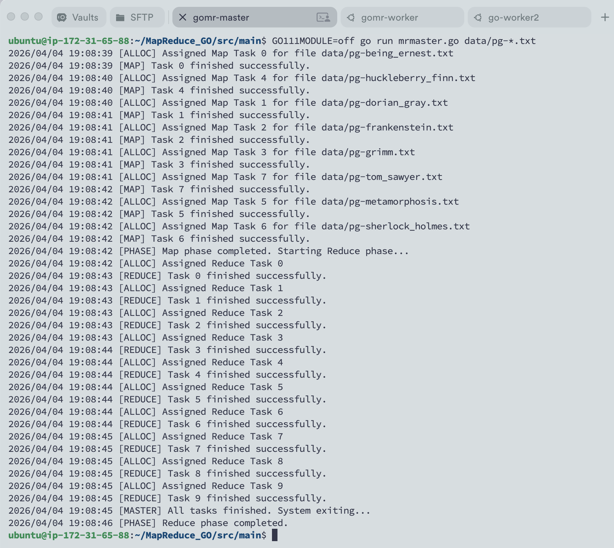
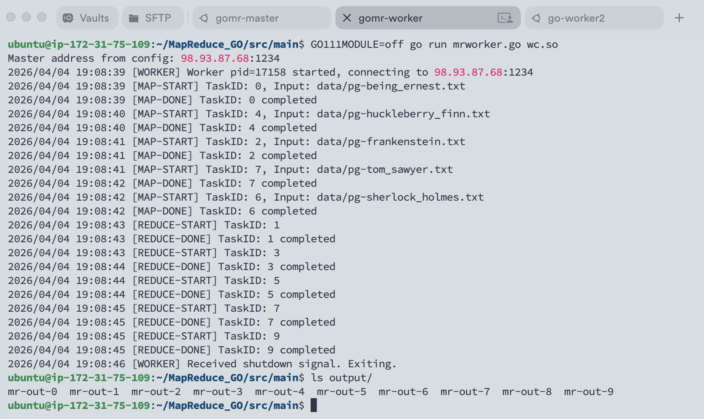
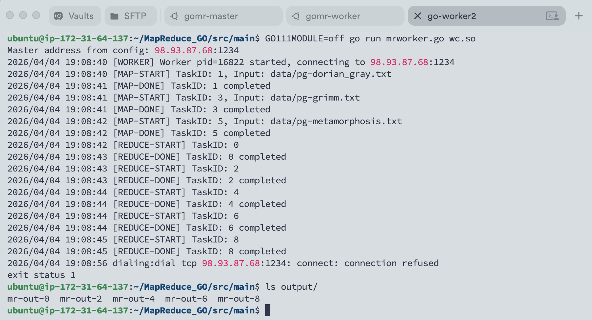

# MapReduce GO

本项目是一个基于 Go 语言实现的简易分布式 MapReduce 框架。支持单 Master 多 Worker 模式，通过 RPC 通信协同完成大规模文本数据的 WordCount（词频统计）任务。

---

## 🚀 环境准备 (Ubuntu/Linux)

在开始运行之前，请确保你的系统已配置好 Go 编译环境及 CGO 支持。

### 1. 安装基础依赖
```bash
# 更新系统包管理器
sudo apt update && sudo apt upgrade -y

# 安装 GCC (编译 .so 插件必备)
sudo apt install gcc -y
```

### 2. 安装 Go 环境

```bash
# 下载 Go 1.26.1
wget [https://go.dev/dl/go1.26.1.linux-amd64.tar.gz](https://go.dev/dl/go1.26.1.linux-amd64.tar.gz)
sudo tar -C /usr/local -xzf go1.26.1.linux-amd64.tar.gz

# 配置环境变量 (写入 .bashrc)
echo 'export PATH=$PATH:/usr/local/go/bin' >> ~/.bashrc
echo 'export GOPATH=$HOME/go' >> ~/.bashrc
echo 'export PATH=$PATH:$GOPATH/bin' >> ~/.bashrc
source ~/.bashrc

# 验证安装
go version
```

------

## 🛠️ 项目初始化与编译

### 1. 克隆项目

```bash
git clone https://github.com/Jeremy4455/MapReduce_GO.git

# 一定要切换到指定目录运行
cd MapReduce_GO/src/main/
```

### 2. 编译 WordCount 插件

由于 Go 的插件模式（Plugin）对编译环境要求严格，请确保在运行 Worker 的机器上执行此编译命令：

```bash
GO111MODULE=off go build -buildmode=plugin -o wc.so ../mrapps/wc.go
```

### 3. 配置 Master IP

编辑 `config.json`，将地址改为 Master 节点所在机器的公网或内网 IP：

```bash
{
    "masterAddr": "<Master_IP_Address>:1234"
}
```

------

## 💻 运行演示

### 第一步：启动 Master 节点

Master 负责监听 RPC 请求、维护任务队列及监控 Worker 状态。

```bash
GO111MODULE=off go run mrmaster.go data/pg-*.txt
```



------

### 第二步：启动 Worker 节点

可以在多台终端或多台云服务器上同时开启 Worker。Worker 会自动向 Master 注册并领取任务。

```bash
GO111MODULE=off go run mrworker.go wc.so
```





------

### 第三步：结果验证

当 Master 输出 `All tasks finished` 后，系统会自动汇总结果。

```bash
# 查看生成的输出文件列表
ls output/

# 查看统计结果前10名
cat output/mr-out-* | sort -k2nr | head -n 10
```

------

## ⚠️ 注意事项

1. **防火墙**：请确保 Master 节点的 `1234` 端口已在安全组中放行。
2. **清理**：若要重新运行，建议先执行 `rm -f mr-out-*` 清理中间文件。

你可以根据实际情况调整 `config.json` 中的字段名（例如从 `config` 改为 `masterAddr`）以匹配你的代码实现。

如果需要修改代码文件，记得修改后重新编译`wc.so`。
